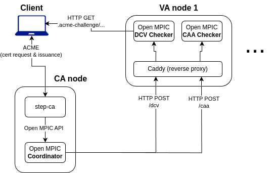

# Open MPIC + Step-CA

본 문서는 **Ubuntu 24.04**를 가정하며, 각 CA 및 VA 노드의 80 및 443 포트가 열려있어야 한다.

## Architecture



본 프로젝트는 CA-side와 VA-side로 나뉘며, CA-side와 VA-side에서는 여러 개의 Docker 컨테이너가 실행된다.
각 컨테이너에 대한 설명은 다음과 같다.

- CA-side (CA node)
  - **Step-CA**: CA 서버
  - **Coordinator**: CA로부터 open-mpic 요청을 받아, 각 VA 노드로 요청을 전달하는 컨테이너
    - 참고: CA와 coordinator 사이의 통신은 [Open MPIC API 스펙](https://open-mpic.org/documentation.html)에 따라 이루어진다.
  - **Unbound**: DNS resolver
- VA-side (VA nodes)
  - **DCV Checker**: 인증서 발급을 위한 Domain Control Validation(DCV) 체크를 수행하는 컨테이너 (실제 HTTP 및 DNS 체크를 수행)
  - **CAA Checker**: CAA(Certification Authority Authorization) 체크를 수행하는 컨테이너
  - **Unbound**: DNS resolver
  - **Caddy**: 들어오는 http 요청의 path(`/caa` 또는 `/dcv`)에 따라 CAA Checker 또는 DCV Checker로 요청을 전달하는 리버스 프록시 컨테이너

## 사용법

먼저, CA 노드와 VA 노드 EC2 인스턴스들을 생성하고, IP주소(혹은 도메인)를 기록해 둔다.

CA 노드의 경우 내부에서 go executable과 Docker 이미지를 빌드해야 하므로 2GB 이상의 메모리를 가진 인스턴스를 사용하는 것을 추천한다.

### 1. CA 노드 설정

```bash
git clone --recursive https://github.com/lemonshushu/openmpic-stepca.git
cd openmpic-stepca/ca

../scripts/install_docker.sh # Docker 설치
```

#### Available Perspectives 설정
> 참고: <https://github.com/open-mpic/open-mpic-containers#available_perspectivesyaml>

`resources/availble_perspectives.yaml` 파일을 열어, VA 노드들의 code, name, rir을 수정한다.
rir의 경우, 해당 노드의 region에 따라 달라진다. (arin, apnic, ripe, lacnic, afrinic 등) 
참고: https://en.wikipedia.org/wiki/Regional_Internet_registry
rir은 반드시 정확하게 입력해야 한다.

#### Coordinator config 설정
> 참고: <https://github.com/open-mpic/open-mpic-containers#configuration-parameters-for-coordinator>

`docker-compose.yml` 파일의 하단의 `coordinator_config` 항목을 수정한다.
특히 `perspectives` 항목이 `available_perspectives.yaml`의 항목과 일치하도록 수정해 준다. CAA 및 DCV endpoint url은 각각 `/caa`와 `/dcv`로 끝나야 한다.
이외에 설정 가능한 사항들은 위의 공식 문서 링크를 참고한다.

#### Docker 이미지 빌드 및 실행

```bash
docker compose build # Step-ca custom Docker image 빌드
docker compose up -d # Step-ca, Coordinator, Unbound 컨테이너 실행
```

그런 다음, `docker compose logs ca` 명령어로 CA 노드의 로그를 확인하고, 거기에 나와 있는 **CA root cert fingerprint**를 기록해 둔다. (나중에 client 설정 시 필요)

### 2. VA 노드 설정

각 VA 노드에서 다음과 같이 수행한다.

```bash
git clone https://github.com/lemonshushu/openmpic-stepca.git # --recursive 옵션은 필요 없음
cd openmpic-stepca/va

../scripts/install_docker.sh # Docker 설치

```

필요에 따라 `docker-compose.yml` 하단의 `dcv_config` 및 `caa_config` 항목을 수정한다. (참고: <https://github.com/open-mpic/open-mpic-containers#configuration-for-caa-checker>)

``` bash
docker compose up -d # DCV checker, CAA checker, Unbound, Caddy 컨테이너 실행
```

### 3. Client 설정

#### Step-cli 및 Certbot 설치
인증서를 발급받고 싶은 클라이언트에서는 **step-cli** 및 **certbot**을 OS에 맞게 설치한다.
- step-cli 설치법: <https://smallstep.com/docs/step-cli/installation>
- certbot 설치법: <https://certbot.eff.org/instructions>

#### Step CA bootstrap
다음과 같이 `step ca bootstrap` 명령어를 실행한다. (CA 노드의 IP주소 혹은 도메인을 입력한다.)

```bash
step ca bootstrap --ca-url https://<your_ca_domain> --fingerprint <CA root cert fingerprint>
```
이 명령어는 CA 노드의 인증서를 로컬에 저장하고, Step CLI가 CA 노드와 통신할 수 있도록 설정한다.

#### 인증서 발급

다음과 같이 certbot을 이용해 인증서를 발급받는다.

```bash

# HTTP-01 challenge를 이용한 인증서 발급
sudo REQUESTS_CA_BUNDLE=$(step path)/certs/root_ca.crt certbot certonly -n --standalone -d <your_domain> --server https://<your_ca_domain>/acme/acme/directory --preferred-challenges http-01

# DNS-01 challenge를 이용한 인증서 발급
sudo REQUESTS_CA_BUNDLE=$(step path)/certs/root_ca.crt certbot certonly --manual --preferred-challenges dns -d <your_domain> --server https://<your_ca_domain>/acme/acme/directory
```

## Step-CA 소스코드 수정사항 설명

본 프로젝트에서는 step-ca의 소스코드를 일부 수정하여 사용한다. (repo: <https://github.com/lemonshushu/certificates>)
수정된 파일은 딱 하나, `acme/challenge.go` 파일이다.

현재 HTTP-01 및 DNS-01 challenge는 multi-perspective로 잘 동작하는 상태이며, TLS-ALPN-01 challenge의 경우 동작하지 않는다. (수정 필요)

`acme/challenge.go` 파일 내 수정사항 목록:
- http01ValidateMulti, dns01ValidateMulti 함수 추가: 기존의 http01Validate, dns01Validate 함수와 유사하나, open-mpic의 여러 VA 노드에 대해 DCV 체크를 수행하도록 수정
  - 기존의 step-ca 내부 **single perspective 체크 후에** openmpic를 이용한 multi perspective 체크를 수행하도록 구현 (사실상 step-ca도 하나의 VA 노드 역할을 수행)
  - CA가 coordinator에 요청을 보내는 API 스펙은 Open MPIC 공식 문서(https://open-mpic.org/documentation.html)를 참고
- `Validate()` : http01Validate, dns01Validate 대신에 http01ValidateMulti, dns01ValidateMulti 호출하도록 수정

현재는 Open MPIC request를 보낼 때 들어가는 `orchestration_parameters`(quorum rule 등)은 하드코딩 되어 있는 상태 (현재는 비어있도록 하드코딩됨)
실험을 위해 quorum rule을 바꿔야 한다면 추후 수정 필요 (configuration 파일에서 읽어오거나 command line argument로 받도록 수정 필요)